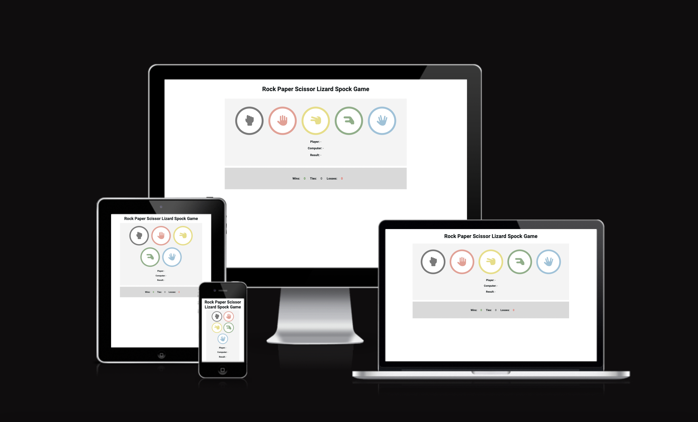
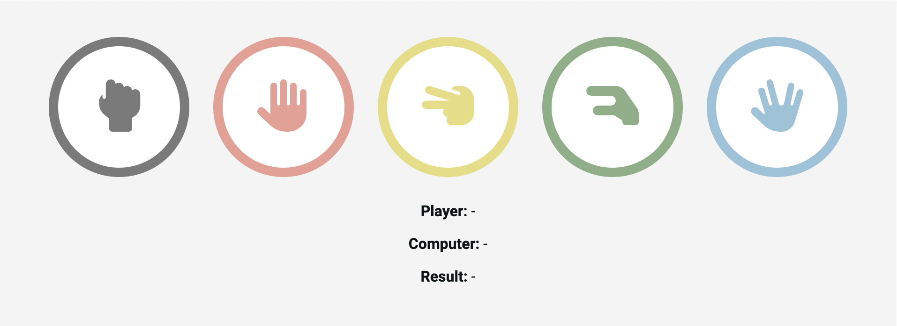
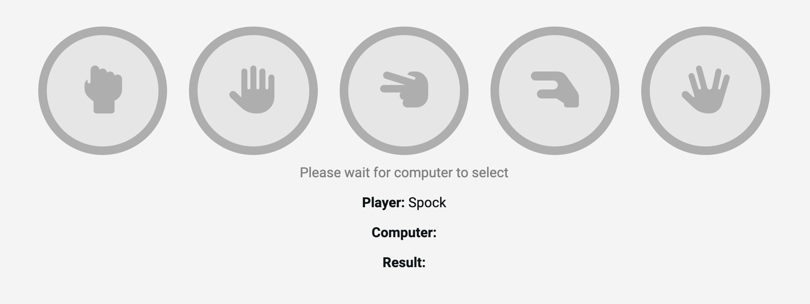
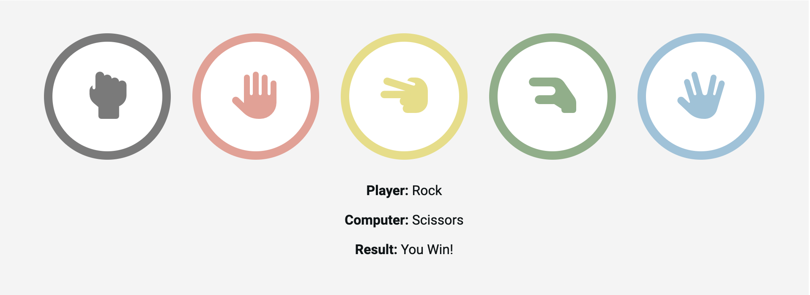
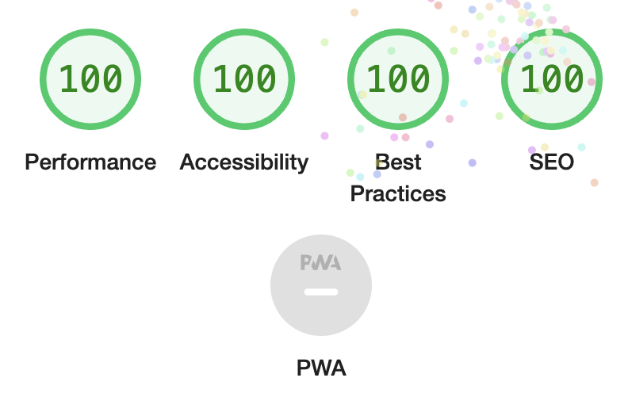
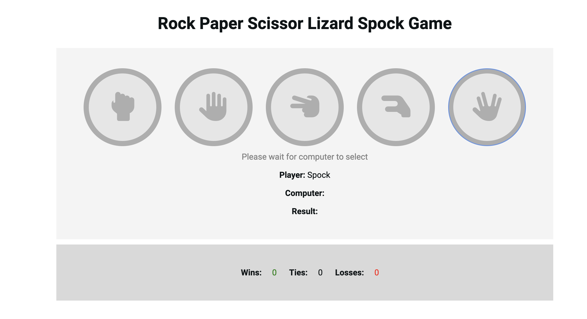
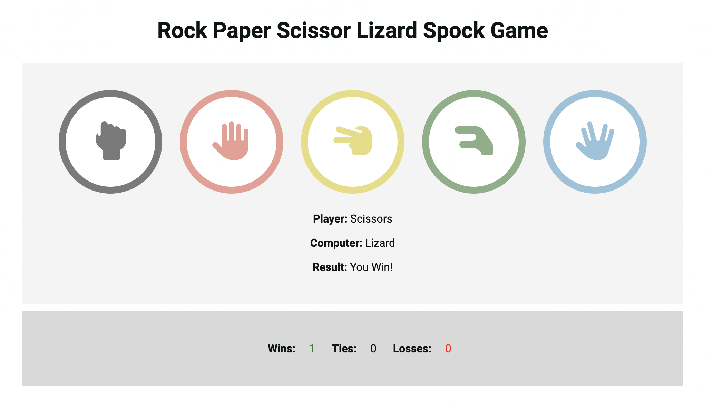

**Portfolio Project 2**

_Rock Paper Scissors Lizard Spock Game_

------
The Rock Paper Scissors Lizard Spock game is a simple game made for anyone - no previous experience needed and can be enjoyed by users of all ages. The user of the page is, by a simple button click, able to play the game against a computer, and then able to see the scores presented.

------
**User Stories**

- As a user of the website, I would like to play the Rock Paper Scissors Lizard Spock Game. Therefore, I click on one of the symbols/buttons, which determines my choice and after 1.5 seconds, displays the computers choice, and then displays the winner.
- As a user of the website, I would like to see the scores. I can find these presented under the game area. 

------
**Features**

_Game Board Area_
- In the game board area, you can find the 5 different symbols needed to play the game. These are made in different colors so that you can easily differentiate between them. 
- In the game board area, before clicking, you can find "Player", "Computer" and "Winner" with empty results.
  
- When clicking a button, the game loads waiting for the computer to make it's choice. All buttons are disabled and therefore gray. The game board area also displays a text that says "Please wait for computer to select"
  
- After clicking a button, you can find the outcomes: the players choice, the computers choice and the result of the game; either ”You lost!”, ”You won!” or ”It’s a tie”. 
  

_Score Board Area_
- In the score board area you find three different kinds of scores: Wins, Ties or Losses. The wins are presented in a green color, ties in black and losses in red.
  

------
**Future Features**
- Future features could be adding a history to the scoreboard, displaying the previous moves of the user and the computer.
- Future features could include making the game a multiplayer game, where the player could choose if they want to play against the computer, or a player 2. 
- Future features could also be introducing an option where you could choose how many options you want to play with. Either 3 - Rock Paper Scissors, 5 - Rock Paper Scissors Lizard Spock, and maybe even 7, 9, 11 different options.   

------
**Wireframes, typography and color scheme**

I chose a very simple layout for the game - but still wanted to make it a little bit playful and therefore choose different colors for my buttons. Wins are presented in green, and losses in red.
Font chosen is roboto.  

------
**Technology**

- HTML - I have used HTML to write the code
- CSS - I have used CSS to style and design the page
- Javascript - I have used Javascript to make the page interactive.
- Google Fonts - I have used Google Fonts to access the font Roboto.
- Font Awesome - I have used Font Awesome for the icons displayed in my buttons.
- GitHub - I have hosted the platform through GitHub 
- GitPod - I have used GitPod to write the code.

------
**Testing**

_Code Validation_
- I have tested the HTML through W3C Validator, and the website passed without warnings or errors. <a href="https://validator.w3.org/nu/?doc=https%3A%2F%2Femmavkarlsson.github.io%2Fportfolio-project2%2F">Results</a>
- I have tested the CSS through the Jigsaw validator, and it passed without warnings or errors. <a href="https://jigsaw.w3.org/css-validator/validator?uri=https%3A%2F%2Femmavkarlsson.github.io%2Fportfolio-project2%2F&profile=css3svg&usermedium=all&warning=1&vextwarning=&lang=sv">Results</a>
- I have checked the Javascript code in JS Hint, which let me know I had some unused variables, so I removed these. 
- The website scored high in all areas when tested through the Lighthouse function in devtools.
  

_Test cases_
1. User clicks on a button, buttons turn gray while waiting for computers choice. A text appear that says "Please wait for the computer to select. The players choice is displayed beneath the text. First time playing, the scores are all set to zero.
  

2. User tries clicking on a button while they are disabled, nothing happenes. 
3. After the game is loaded, the results are presented. 
 

4. User clicks on a button again, computers choice as well as the results are cleared and step (1-3) is repeated. 

_Bugs_
- Initially, I used event.target.name to access the name of the button that was clicked. However, this only updated the users-choice text content when the button border was clicked, not the icon in it - giving me different outcomes based on where I clicked. I then changed this so that the button had event listeners that targeted a function, where another function was called (makeUserSelection). After formatting these functions, I was able to get the Players result displayed no matter where on the button I clicked.

_Supported screens and browsers_
- I confirmed the website and the game works in different browsers (Chrome, Safari, Firefox)
- I confirmed the website is responsive and works both on desktops, tablets, and mobile devices.

------
**Deployment**
- The site was deployed to GitHub pages through the following steps:
    1. Open the repository and go to Settings
    2. In the menu to the left, press Pages
    3. Under Branch, select Main
    4. The link to the website is then provided at the top of the page
* The site was deployed to GitPod through the following steps:
    1. Open the repository and press the green ”GitPod” button
    2. In the terminal, write ”python3 -m http.server” and press enter
    3. A pop up will appear at the bottom right, press ”Open Browser”
    4. The page will open in a new tab.

**Credits**
- A lot of the HTML and CSS, such as structure of page and button styles, are inspired by the Love Math project.
- Icons are collected from Font Awesome.
- Fonts are from Google Fonts
- I have watched <a href="https://youtu.be/n1_vHArDBRA">this</a> video on Youtube which helped me with generating a random choice for the computer.
- I have watched <a href="https://youtu.be/_f2qLZ5dhWU">this</a> video on Youtube which led me to be able to disable my buttons while the computer was making it's choice.
- <a href="https://youtu.be/nGfTjA8qNDA">This</a> video helped me further understand setTimeOut and helped me build the code for my own timeout function.
- I have had a great deal of help from my mentor Rohit Sharma

